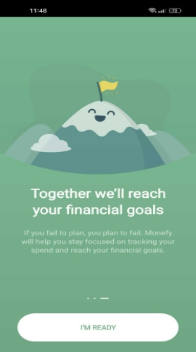

**Submitted by:**        Sadia Mushtaq

Data Annotator

**Submitted to:**        Sabeeka Rasul

Lead QA Engineer

`                           `**Skill-up2.0 Final assessment QA**

|**TABLE OF CONENT**|
| :-: |
|
**                                                            

`                                                           `**TASK 1**
|
|
- Exploratory testing session of the Monefy app

|
|- The testing session for the Monefy application|
|- Exploratory testing charter|
|
- Findings of exploratory testing

|
|- Bug reporting:|
|
- Prioritization of testing charters

|
|
- Time planning for each charter

|
|
- Risks need to be mitigated for the Monefy application**:**

|
|`                                                         `**TASK 2**|
|
- API Testing

|
|
- Auth – createtoken:

- POST

- Test cases

|
|
- Booking:

- Booking – GetBookingIds:

- GET

- Test cases

|
|
- Booking – CreateBooking:

- POST

- Test cases

|
|
- Ping

- Ping – HealthCheck

- Test cases

|
|
- Booking- updatebooking

- PUT

- Test cases
|
|
- Booking- partialupdatebooking

- PATCH

- Test cases
|
|
- Booking- deletebooking

- DELETE

- Test cases
|
|- Bugs and error handling|

`                                                         `**TASK 1**       
**

`                            `**Exploratory testing session of the Monefy app**   

**Steps for downloading the Monefy app on Android:**

1. **Unlock Your Android Device:** Make sure your Android device is unlocked and connected to the internet (either through Wi-Fi or mobile data).
1. **Open Google Play Store**: Locate the Google Play Store icon on your device's home screen or in the app drawer, and tap on it to open the Play Store.
1. **Search for Monefy:** Once the Google Play Store is open, tap on the search bar at the top of the screen and type in "Monefy" (without the quotes), and press the "Enter" key on your device's keyboard.
1. **Select Monefy:** From the search results, you should see the Monefy app listed. It will have an icon and the app's name. Tap on the app's icon or name to open its dedicated page on the Play Store.
1. **Install Monefy:** On the Monefy app's page, you will see an "Install" button. Tap on it to start the download and installation process.
1. **Permissions:** The app may request certain permissions, such as access to your device's storage, camera, etc. Read through these permissions and tap "Accept" to proceed. These permissions are necessary for the app's functionality.
1. **Download and Installation**: The Google Play Store will begin downloading the app to your device. The progress is typically indicated by a circular loading icon on the app's page.
1. **Open Monefy:** Once the installation is complete, the "Install" button will change to an "Open" button. You can tap this button to launch the Monefy app for the fi 
**

`                             `**The testing session for the Monefy application**

Performing a testing session for the Monefy app involves checking its various features and functionalities to ensure that it works as intended. Here's a general outline of steps we can take to 

**Preparation:** Make sure have the latest version of the Monefy app installed on Android device.** Ensure that device is connected to a stable internet connection if the app requires internet access for certain features.

**Test Scenarios**: Identify the key features and functionalities of the Monefy app that want to test. Some common areas to consider are:

- Adding and managing expenses and income.
- Creating categories and subcategories for transactions.
- Setting up accounts and managing account balances.
- Reviewing reports and statistics.
- Syncing data across devices (if applicable).
- Setting a budget or financial goals.
- Exporting or backing up data.

**Test Data**: Prepare test data that will use during the testing session. This can include example transactions, categories, accounts, budgets, etc.

**Execution:** Start testing the Monefy app using the scenarios and test data prepared. Here's a general approach:

- Open the app and navigate to different sections to test each feature.
- Add sample transactions to test expense and income tracking.
- Create and manage categories to ensure they are functioning properly.
- Set up accounts and check if account balances update correctly.
- Explore the reporting and statistics sections to verify data accuracy.
- Test synchronization features if the app offers data syncing.
- Check if setting a budget or financial goal works as expected.

Test any export or backup features to ensure data can be saved and retrieved.

- **Data Validation:** After performing various actions, validate that the data displayed in the app matches the expectations. Ensure that calculations are accurate and that information is being presented correctly.
- **Boundary Testing**: Test the app using extreme values and scenarios to check how it handles cases like very high or very low amounts, long descriptions, and unusual transaction types.
- **Error Handling:** Intentionally input incorrect or invalid data to see how the app handles errors. Check if the app provides appropriate error messages and guides users on how to correct their input.
- **Compatibility and Performance:** Test the app on different Android devices (if possible) to ensure it functions well across various screen sizes and resolutions. Also, monitor the app's performance for responsiveness and smooth operation.
- **Documentation Review:** If there's user documentation or a user guide provided with the app, review it to ensure that the app's features align with the documentation.
- **Feedback and Reporting:** If encounter any bugs, glitches, or issues during testing, make note of them. If the app has a feedback or reporting mechanism, use it to provide detailed feedback to the app's developers.

`                                  `**EXPLORATORY TESTING CHARTER**

|**Charter Title:**|In-Depth Exploration of Monefy App's Core Functionalities and Usability|
| - | - |
|**Testers**|Sadia Mushtaq|
|**Duration**||
|**Objective:**|The goal of this exploratory testing session is to deeply explore the Monefy app's core functionalities and user interface to uncover any potential usability issues, functional inconsistencies, and user experience challenges. We aim to ensure that the app provides a seamless and user-friendly experience for managing finances, tracking transactions, and setting budgets.|
|
**Scope:**

|
- Transaction entry and management (expenses and income)

- Category and subcategory creation and management

- Account types and balances

- Budget setting, tracking, and alerts

- Reports and statistics

- User interface and usability aspects

|
|
**Session Approach:**

|
- Actively navigate through the app's functionalities.

- Experiment with different scenarios and edge cases.

- Focus on user interactions and user interface intuitiveness.

- Take notes of observations, bugs, and usability concerns.

- Prioritize issues based on their potential impact.

|
|
**                                  

`                                            `**Testing Notes:**
||
|
**Transaction Entry and Management:**

|
- Add various types of transactions (expenses and income).

- Modify and delete transactions to assess app responsiveness.

- Observe transaction entry speed and ease.

|
|
**Account Types and Balances:**

|
- Add transactions to different account types (e.g., cash, bank).

- Verify accurate balance updates for each account.

- Test account creation and deletion.

|
|
**Budget Setting, Tracking, and Alerts:**

|
- Set budgets for different categories.

- Trigger budget alerts by exceeding limits.

- Verify that alerts are timely and informative.

|
|
**User Interface and Usability:**

|
- Evaluate overall app layout, color scheme, and typography.

- Test navigation flow and intuitiveness.

- Observe how user inputs and gestures are handled
|
|
**Error Handling and Feedback:**

|
- Intentionally input incorrect data and verify app's error handling.

- Check if error messages are informative and actionable.

|
|
**Category and Subcategory Management:**

|
- Create, edit, and delete categories and subcategories.

- Assign transactions to different categories and subcategories.

Check for any glitches or inconsistencies in category management

|

`                                   `**Findings of exploratory testing:**

There are the findings of exploratory testing notes of the Monefy app.

1. **Transaction Entry and Management:**

- **Test case: Basic Transaction Entry:**

Add a basic expense transaction.

**Steps:**

- Open the Monefy app.
- Navigate to the "Expenses" section.
- Tap the "+" button to add a new expense transaction.
- Enter a description, amount, and select a category.
- Select the current date.
- Save the transaction.

**Expected Outcome**: The transaction should be added to the expense list with the entered details. The account balance should be updated accordingly as we can see in the below screenshots.

`         ` 

- **Test case: Edit an existing expense transaction description:**

**Steps:**

- Open the Monefy app.
- Navigate to the "Expenses" section.
- Select an existing expense transaction like I choose the house expense as I attached the screenshots
- Tap the "Edit" button.
- Modify the description.
- Save the changes.

**Expected Outcome:** The transaction's description should be updated with the modified text.as we can see in the below screenshot after updating the transaction the alert of updated was generated.

![Screenshot_2023-08-21-16-26-48-36_3bc5686642335ac6d64b21eebd0b56f9.jpg] 

- **Test case: Delete an expense transaction:**

**Steps:**

- Open the Monefy app.
- Navigate to the "Expenses" section.
- Select an existing expense transaction.
- Tap the "Delete" button.
- Confirm the deletion.

**Expected Outcome:** The transaction should be removed from the expense list, and the account balance should update accordingly.

- **Test case: Attempt to add an expense transaction without entering a description:**

**Steps:**

- Open the Monefy app.
- Navigate to the "Expenses" section.
- Tap the "+" button to add a new expense transaction.
- Leave the description field empty.
- Enter an amount and select a category.
- Select the current date.
- Save the transaction.

**Expected Outcome:** An error message should indicate that a description is required.

- **Test case: Attempt to add an expense transaction without entering an amount:**

**Steps:**

- Open the Monefy app.
- Navigate to the "Expenses" section.
- Tap the "+" button to add a new expense transaction.
- Enter a description and select a category.
- Select the current date.
- Save the transaction.

**Expected Outcome:** An error message should indicate that an amount is required.

- **Test case: Add an expense transaction with a very large amount**.

**Steps:**

- Open the Monefy app.
- Navigate to the "Expenses" section.
- Tap the "+" button to add a new expense transaction.
- Enter a description, a very large amount, and select a category.
- Select the current date.
- Save the transaction.

**Expected Outcome:** The transaction should be added, and the account balance should update accordingly.

1. **Budget Setting, Tracking, and Alerts:**

There are the following test cases for budget Setting, Tracking, and Alerts

<table><tr><th colspan="1" valign="top">Test Case#</th><th colspan="1" valign="top">TC-01</th><th colspan="1" valign="top">Created By: </th><th colspan="1" valign="top">Darvis QA</th></tr>
<tr><td colspan="1" valign="top"></td><td colspan="1" valign="top"></td><td colspan="1" valign="top">Created On:</td><td colspan="1" valign="top">22\.08.2023</td></tr>
<tr><td colspan="1" valign="top">Objective</td><td colspan="3" valign="top">The budget, tracking and alert should be generated.</td></tr>
<tr><td colspan="1" valign="top">Test Case Description</td><td colspan="3" valign="top">Test cases for budget Setting, Tracking, and Alerts</td></tr>
<tr><td colspan="1" valign="top">Assumptions</td><td colspan="3" valign="top">
1. Monefy is stable and working

2. The user has the knowledge of how to use the application

3. Home page is accessible and working
</td></tr>
<tr><td colspan="1" valign="top">Constraints</td><td colspan="3" valign="top">
1. Application is not working

2. The application is experiencing severe lag time
</td></tr>
<tr><td colspan="1" valign="top">Prereq Conditions</td><td colspan="3" valign="top">
1. Ensure that the application is running.

2. Have access to the necessary testing environment.
</td></tr>
<tr><td colspan="1" rowspan="4" valign="top">
Procedure

</td><td colspan="1" valign="top"><b>Test Cases</b></td><td colspan="1" valign="top"><b>Action</b></td><td colspan="1" valign="top"><b>Expected Result</b></td></tr>
<tr><td colspan="1" valign="top">Set a budget for a specific category with a valid amount.</td><td colspan="1" valign="top">
- Open the Monefy app.

- Navigate to the "Budget" section.

- Select a category.

- Enter a budget amount.

- Set the start and end dates for the budget.

- Save the budget
</td><td colspan="1" valign="top">The budget should be successfully set for the selected category.</td></tr>
<tr><td colspan="1" valign="top">Set a budget for a category with a past start date.</td><td colspan="1" valign="top">
- Open the Monefy app<i>.</i>

- Navigate to the "Budget" section.

- Select a category.

- Enter a budget amount.

- Set a start date in the past.

- Save the budget
</td><td colspan="1" valign="top">The app should validate that the start date is in the future and provide an appropriate error message.</td></tr>
<tr><td colspan="1" valign="top">Set a budget for a category with a future start date.</td><td colspan="1" valign="top">
- Open the Monefy app.

- Navigate to the "Budget" section.

- Select a category.

- Enter a budget amount.

- Set a start date in the future.

- Save the budget
</td><td colspan="1" valign="top">The budget should be set successfully with the future start date.</td></tr>
<tr><td colspan="1"></td><td colspan="1" valign="top">Add transactions that exceed the budget limit for a category.</td><td colspan="1" valign="top">
- Open the Monefy app.

- Navigate to the "Expenses" section.

- Select a category with a set budget.

- Add transactions that exceed the budget limit.

Verify the budget tracking and balance remaining
</td><td colspan="1" valign="top">The app should accurately track expenses and indicate that the budget has been exceeded.</td></tr>
<tr><td colspan="1"></td><td colspan="1" valign="top">Trigger budget alerts after modifying transactions</td><td colspan="1" valign="top">
- Open the Monefy app.

- Navigate to the "Expenses" section.

- Select a category with a set budget.

- Add transactions within the budget limit.

- Edit a transaction to exceed the budget limit.

- Verify if the app triggers an alert.

</td><td colspan="1" valign="top">An alert or warning should appear indicating that the budget for the category has been exceeded.</td></tr>
<tr><td colspan="1" valign="top">Evaluating Success Criteria</td><td colspan="3" valign="top">The budget, tracking and alert should be generated according to the respective action</td></tr>
<tr><td colspan="1" valign="top">Actual Result</td><td colspan="3" valign="top"></td></tr>
<tr><td colspan="1" valign="top">Test status</td><td colspan="3" valign="top"></td></tr>
<tr><td colspan="1" valign="top">Additional notes</td><td colspan="3" valign="top"></td></tr>
<tr><td colspan="1" valign="top">Executed by</td><td colspan="3" valign="top">Darvis QA</td></tr>
<tr><td colspan="1" valign="top">Executed on</td><td colspan="3" valign="top">22\.08.2023</td></tr>
</table>

1. **User Interface and Usability:**

- **Test Case:** Launch the app and observe the loading time.

**Expected Outcome:** The app should load within an acceptable time frame.

- **Test Case:** Observe the overall layout and design of the app's home screen.

**Expected Outcome:** The home screen should have a clear and intuitive layout, with easy-to-identify sections and buttons.

- **Test Case:** Navigate through the main sections of the app (Expenses, Income, Budgets, etc.).

**Expected Outcome:** Navigation should be smooth and intuitive, with clear section labels.

- **Test Case:** Test the responsiveness of the app to various gestures (tap, swipe, pinch, etc.).

**Expected Outcome:** The app should respond accurately and promptly to different gestures.

- **Test Case**: Test the readability of text and numbers in different lighting conditions.

**Expected Outcome:** Text and numbers should be easily readable in different lighting environments.

- **Test Case:** Test the app's behavior when switching between portrait and landscape orientations.

**Expected Outcome**: The app's layout and content should adapt appropriately to the screen orientation.

- **Test Case:** Test the accessibility features of the app, such as text-to-speech compatibility.

**Expected Outcome:** The app should be accessible and usable for users with disabilities.

Navigation and Flow:

- **Test Case:** Test the back button functionality within the app.

**Expected Outcome**: The back button should navigate the user to the previous screen or section.

- **Test Case:** Verify the consistency of navigation icons and buttons across different screens.

**Expected Outcome:** Navigation icons and buttons should be consistent and recognizable throughout the app.

- **Test Case**: Test the "Home" button functionality to return to the app's main screen.

**Expected Outcome**: The "Home" button should navigate the user to the app's main screen, regardless of the current section.

- **Test Case**: Test the use of breadcrumbs or navigation paths to help users understand their current location within the app.

**Expected Outcome:** Breadcrumbs or navigation paths should provide clear context about the user's current location.

**Input and Interaction:**

- **Test Case:** Test the responsiveness of input fields to keyboard input.

**Expected Outcome:** Input fields should accept keyboard input and respond appropriately.

Test Case: Test the behavior of dropdown menus and selection lists.

**Expected Outcome:** Dropdown menus should display available options accurately, and selections should be intuitive.

- **Test Case:** Test the behavior of buttons and links, including their appearance and clickability.

**Expected Outcome:** Buttons and links should have clear visual cues and respond accurately to clicks.

- **Test Case:** Test the behavior of toggle switches, checkboxes, and radio buttons.

**Expected Outcome:** Toggle switches, checkboxes, and radio buttons should accurately reflect their state and allow user interaction.

- **Test Case:** Test the behavior of date pickers and time pickers.

**Expected Outcome:** Date pickers and time pickers should allow users to select dates and times accurately.

1. **Visual Design and Layout:**
- **Test Case:** Test the app's color scheme for visual appeal and readability.

**Expected Outcome:** The color scheme should enhance usability and not compromise readability.

- **Test Case:** Test the app's typography for legibility and consistency.

**Expected Outcome:** Text should be easy to read and consistent in font style and size.

- **Test Case:** Test the app's use of icons for clarity and understanding.

**Expected Outcome:** Icons should be easily recognizable and convey their intended meanings.

- **Test Case:** Test the alignment and spacing of elements on different screens.

**Expected Outcome:** Elements should be properly aligned and spaced for a balanced visual design.

1. **Error Handling and Feedback:**

There are the following test cases for error handling and feedback

- **Test Case:** Test the app's response to incorrect or incomplete form submissions.

**Expected Outcome:** The app should provide informative error messages that guide users in correcting their input.

- **Test Case**: Test the feedback provided when completing an action (e.g., adding a transaction or saving a setting).

**Expected Outcome:** The app should provide clear confirmation messages after successful actions.

- **Test Case:** Test the behavior of undo and redo actions (if applicable).

**Expected Outcome:** Undo and redo actions should accurately reverse or redo user actions.

- **Test Case:** Test the visibility and accessibility of tooltips and help text.

**Expected Outcome:** Tooltips and help text should be easily accessible and provide relevant information.

1. **Account Types and Balances:**

**Accounts:**

- Create a new account of type "Cash."
- Create a new account of type "Credit Card."
- Create a new account of type "Bank Account."
- Add an expense transaction with a specific account selected.
- Add an income transaction with a specific account selected.
- Verify that account balances update accurately after transactions.
- Delete an account with no associated transactions.
- Delete an account with associated transactions.

1. **Currency Conversion:**

- **Test Case: Verify that currency conversion rates are up-to-date.**

**Steps**:

- Open the Monefy app.
- Navigate to the currency conversion section.
- Check the displayed currency conversion rates.

**Expected Outcome:** Conversion rates should reflect accurate and current values.

- **Test Case:** **Test currency conversion accuracy for common currencies:**

**Steps:**

- Open the Monefy app.
- Create a new expense transaction in one currency.
- Verify that the converted amount is calculated correctly.

**Expected Outcome:** The converted amount should match the expected value based on the currency conversion rate.

- **Test Case: Test currency conversion accuracy for less common currencies:**

**Steps:**

- Open the Monefy app.
- Create a new expense transaction in a less common currency.
- Verify that the converted amount is calculated accurately.

**Expected Outcome:** The app should handle less common currencies and provide accurate conversion calculations.

1. **Search Functionality:**

- **Test Case: Verify that the search field is present and functional:**

**Steps:**

- Open the Monefy app.
- Navigate to the "Transactions" section.
- Locate the search field.

**Expected Outcome:** The search field should be visible and ready to accept user input.

- **Test Case: Test searching for a specific transaction by description.**

**Steps:**

- Open the Monefy app.
- Navigate to the "Transactions" section.
- Enter a specific transaction description in the search field.
- Press the search button.

**Expected Outcome:** The app should display a list of transactions matching the provided description.

1. **Filtering Functionality:**

- **Test Case: Verify that filtering options are available and functional:**

**Steps:**

- Open the Monefy app.
- Navigate to the "Transactions" section.
- Locate the filtering options (date range, category, etc.).
- **Expected Outcome:** Filtering options should be visible and selectable.
- **Test Case: Test filtering transactions by date range:**

**Steps**:

- Open the Monefy app.
- Navigate to the "Transactions" section.
- Select a specific date range using the filtering options.
- Apply the filter.

**Expected Outcome:** The app should display a list of transactions within the selected date range.

`                                       `**NEATIVE TEST CASES:**

**Negative Test Case:** **Invalid Login Credentials**

**Test Scenario:** Attempt to log in with incorrect username and password.

**Test Steps:**

- Launch the Monefy app.
- Enter an incorrect username and password combination.
- Tap the "Login" button.
- Expected Result: The app should display an error message indicating that the login credentials are invalid.
- **Negative Test Case: Adding Expense with Invalid Amount**

**Test Scenario:** Try to add an expense with a negative or non-numeric amount.

**Test Steps**:

- Open the Monefy app and navigate to the "Expenses" section.
- Tap the "Add Expense" button.
- Enter a negative value or a non-numeric character in the amount field.
- Save the expense.

**Expected Result:** The app should prevent the user from adding an expense with an invalid amount and display an appropriate error message.

- **Negative Test Case: Exceeding Budget Limit**

**Test Scenario:** Add an expense that would exceed the set budget limit.

**Test Steps:**

- Launch the Monefy app.
- Go to the "Budgets" section.
- Set a budget limit for a specific category.
- Add an expense that would exceed the set budget limit for that category.

**Expected Result:** The app should notify the user that the expense exceeds the budget limit and prevent adding the transaction.

- **Negative Test Case: Sync Error**

**Test Scenario:** Simulate a scenario where there's a sync error with the cloud service.

**Test Steps:**

- Open the Monefy app and enable cloud sync.
- Attempt to sync data while the device is offline or experiencing connectivity issues.

**Expected Result:** The app should display an error message indicating that there was a problem syncing data due to network issues.

**                                           

`                                           `**BUG REPORTING:**

While doing the exploratory testing of the Monefy app, I found the bug that was reported below as per the Darvis format.

`                                          `

`                                           `**Inaccurate Expense Distribution Chart:**

Below there is a screenshot of the bug. When we add those percentage displays the total was greater than 100%.

**Bug:** The "Expense Distribution" chart in the "Expenses" section displays incorrect percentages for different categories.

**Impact:** Users might misinterpret their spending habits due to inaccurate chart data.

**Defect ID:** ID\_APPMONEFY\_MODULE\_001

**Defect title:** The "Expense Distribution" chart in the "Expenses" section displays incorrect percentages for different categories.

**Defect description**	

•	Open the application

•	Open the home page

•	Display of incorrect percentages for different categories

**Expected results**:

There should be correct percentage display because Users might misinterpret their spending habits due to inaccurate chart data.

**Actual results**:	

Display incorrect percentages for different categories.

**Severity**:	Medium

**Priority:**	Medium

**Module Affected:**	RMX3393

**Environment**:	Model of mobile: RMX3393, Monefy version: 1.16.3.2198

**Reported By:**	Darvis tester

**Reported On:**	18-08-2023

**Status**:	           New

**Assigned**:	           Developer ABC

`                                        `**Prioritization of testing charters**

Prioritization of exploratory testing is essential to focus on areas of the application that are most critical, prone to issues, or likely to impact the user experience. Here's a prioritized list of areas in the Monefy app that I might consider testing first and the reasons for their prioritization:

**1. Transaction Entry and Management**:

**Priority:** High

**Reason:** Transaction entry and management are core features of the app. Ensuring that users can accurately add, edit, and manage transactions is crucial to the app's functionality.

**2. Budget Settings and Tracking:**

**Priority:** High

**Reason:** Budget management is a key selling point of the app. Ensuring that users can set budgets accurately, track their spending, and receive alerts for budget overruns is important for user satisfaction.

**3. Account Balances and Types:**

**Priority:** Medium

**Reason**: While important, issues in account balances and types may not have an immediate impact on the user experience. However, they should be addressed to maintain accurate financial tracking.

**4. User Interface and Usability:**

**Priority:** Medium

**Reason**: While issues in the user interface and usability can affect user experience, they might not directly impact financial transactions or budgeting accuracy.

**5. Currency Conversion:**

**Priority:** Medium

**Reason**: Currency conversions are important but might not be used by all users. They impact a specific subset of users.

**6. Error Handling and Feedback:**

**Priority**: Low

**Reason**: Error handling and feedback issues can impact user experience, but they might not have an immediate impact on the app's core functionality.

**7. Search and Filtering:**

**Priority**: Low

Reason: Search and filtering issues can affect users looking for specific transactions, but they might not be as critical as core financial features.

**8. Responsive Design and Compatibility:**

**Priority:** Low

**Reason:** While important for user experience, compatibility issues might not directly impact the core functionality of the app.

1. **Visual Design and Layout:** 

**Priority**: Low 

**Reason:** Issues related to visual design and layout can affect user perception, but they might not impact core financial features.

`                                        `**Time planning for each charter**

**1. Transaction Entry and Management**: (Estimated Time: 2-3 hours) This charter involves testing core transaction functionalities, such as adding, editing, and managing transactions. I want to cover various scenarios, including different transaction types, categories, and amounts.

**2. Budget Settings and Tracking**: (Estimated Time: 2-3 hours) Testing budget settings and tracking includes scenarios like creating, modifying, and tracking budgets. 

**3. Account Balances and Types:** (Estimated Time: 1-2 hours) This charter involves checking the accuracy of account balances and the proper functioning of different account types (cash, credit card, bank account).

**4. User Interface and Usability:** (Estimated Time: 2-3 hours) Testing user interface and usability covers navigation, layout, responsiveness, and general user interactions across various sections of the app.

**5. Currency Conversion and Multi-Currency Transactions:** (Estimated Time: 2 hours) This charter focuses on testing currency conversion accuracy and the handling of multi-currency transactions.

**6. Error Handling and Feedback:** (Estimated Time: 1-2 hours) Focus on testing how the app handles errors, displays error messages, and provides feedback to users.

**7. Search and Filtering**: (Estimated Time: 1-2 hours) Test search functionality and the effectiveness of sorting and filtering options.

**8. Responsive Design and Compatibility:** (Estimated Time: 2 hours) This charter involves testing how the app behaves on different devices, orientations, and OS versions.

**9. Visual Design and Layout:** (Estimated Time: 1-2 hours) Focus on visual consistency, typography, iconography, and layout alignment.

`                               `**Risks need to be mitigated for the Monefy application:**

Following are the risks that need to mitigate for this kind of application.

**1. Data Security and Privacy:**

**Risk:** Unauthorized access to sensitive financial data, user account information, or personal details.

**Mitigation:** Implement strong encryption for user data, secure authentication mechanisms, and regular security audits. Comply with relevant data privacy regulations.

**2. Budgeting Inaccuracies:**

**Risk:** Incorrect calculations or tracking of budgets, leading to inaccurate financial planning.

**Mitigation:** Thoroughly test budget settings, tracking, and alerts to ensure accuracy. Implement proper currency conversion and multi-currency transaction handling.

**3. Lack of Accessibility:**

**Risk:** Excluding users with disabilities from using the app due to lack of accessibility features.

**Mitigation:** Implement accessibility guidelines, such as screen reader compatibility and keyboard navigation, to make the app usable for all users

**4. Network Connectivity Issues:**

**Risk:** App functionality impacted by poor network connectivity, leading to incomplete or delayed transactions.

**Mitigation:** Design the app to handle offline scenarios gracefully, allowing users to complete transactions even without a stable internet connection.

**5.Usability Issues:**

**Risk:** Complex or confusing user interface, leading to user frustration and decreased adoption.

**Mitigation:** Conduct usability testing to identify and address interface and interaction issues. Prioritize user-centered design and intuitive navigation.

`                                                              `**TASK 2**

`                                                           `**API Testing**

- **Auth – CreateToken:**
- **POST**

**Steps:**

1. Open the postman
1. **Create a New Request:** create a new request by clicking the "New" button 
1. **Select the Request Type:** In the request tab, select "POST" from the dropdown menu.
1. **Set the Request URL:** Enter the URL of the API endpoint where want to send the POST request.
1. **Add Request Body:** In the "Body" tab, choose the format for request body (e.g., JSON, form-data, raw, etc.) and then input the data want to send in the request. This step is crucial for POST requests as they usually require some data to be sent in the request body.
1. **Send POST Request**: After setting up the URL, headers, and request body, click the "Send" button to send the POST request.
1. **View Response:** Once the request is sent, you'll see the response in the "Response" section below the request details. The response will include information such as the status code, headers, and the response body.
1. **Status Code:** Indicates whether the request was successful or if there was an error. Common status codes include 200 (OK), 201 (Created), 400 (Bad Request), 401 (Unauthorized), etc.
1. **Headers:** Displays the headers included in the response.
1. **Response Body:** Shows the data returned by the API in the response body. This can be JSON, HTML, XML, or any other format.
1. **Inspect Response:** Analyze the response to ensure that request was successful and to extract any relevant data from the response body.

<table><tr><th colspan="1" valign="top">Test Case#</th><th colspan="1" valign="top">TC-01</th><th colspan="1" valign="top">Created By: </th><th colspan="1" valign="top">Darvis QA</th></tr>
<tr><td colspan="1" valign="top"></td><td colspan="1" valign="top"></td><td colspan="1" valign="top">Created On:</td><td colspan="1" valign="top">22\.08.2023</td></tr>
<tr><td colspan="1" valign="top">Objective</td><td colspan="3" valign="top">To create user for auth factor</td></tr>
<tr><td colspan="1" valign="top">Test Case Description</td><td colspan="3" valign="top">The application should allow the creation of a user.</td></tr>
<tr><td colspan="1" valign="top">Assumptions</td><td colspan="3" valign="top">
4. Postman is stable and working

5. The user has the knowledge of how to use the application

6. Home page is accessible and working
</td></tr>
<tr><td colspan="1" valign="top">Constraints</td><td colspan="3" valign="top">
3. Application is not working

4. The application is experiencing severe lag time
</td></tr>
<tr><td colspan="1" valign="top">Prereq Conditions</td><td colspan="3" valign="top">
Ensure that the API is up and running.

Have access to the necessary testing environment.
</td></tr>
<tr><td colspan="1" rowspan="4" valign="top">Procedure</td><td colspan="1" valign="top"><b>Test Case</b></td><td colspan="1" valign="top"><b>Action</b></td><td colspan="1" valign="top"><b>Expected Result</b></td></tr>
<tr><td colspan="1" valign="top">Create user</td><td colspan="1" valign="top">
- Import HTTP Post method “<https://restful-booker.herokuapp.com/auth>”.

- Go to the body and add the user and password.   Run the endpoint.
</td><td colspan="1" valign="top">Token generated.</td></tr>
<tr><td colspan="1" valign="top">Change username type</td><td colspan="1" valign="top">Go to the body and change the type of the user from string to int.</td><td colspan="1" valign="top">The token is not generated. “Bad Credentials”</td></tr>
<tr><td colspan="1" valign="top">Unique Token</td><td colspan="1" valign="top">Every time a unique token should be generated.</td><td colspan="1" valign="top">Unique token.</td></tr>
<tr><td colspan="1" valign="top">Evaluating Success Criteria</td><td colspan="3" valign="top">The user should be created.</td></tr>
<tr><td colspan="1" valign="top">Actual Result</td><td colspan="3" valign="top">The user created and a token was generated.</td></tr>
<tr><td colspan="1" valign="top">Test status</td><td colspan="3" valign="top"></td></tr>
<tr><td colspan="1" valign="top">Additional notes</td><td colspan="3" valign="top"></td></tr>
<tr><td colspan="1" valign="top">Executed by</td><td colspan="3" valign="top">Darvis QA</td></tr>
<tr><td colspan="1" valign="top">Executed on</td><td colspan="3" valign="top">22\.08.2023</td></tr>
</table>

- **Booking:**
- **Booking – GetBookingIds:**
- **GET:**

**STEPS:**

1. Open the postman
1. **Create a New Request:** create a new request by clicking the "New" button
1. **Select the Request Type:** In the request tab, select "GET" from the dropdown menu want to perform a GET request.
1. **Set the Request URL**: Enter the URL of the API endpoint that I want to retrieve data from in the URL field.
1. **Add Headers (if necessary):** If API requires specific headers for authentication or other purposes, you can add them by clicking on the "Headers" tab:
1. Click on the "Key" column and enter the name of the header.
1. Click on the "Value" column and enter the value of the header, if applicable.
1. **Send GET Request:** After setting up the request URL and any necessary headers, click the "Send" button to send the GET request.
1. **View Response:** Once the request is sent, will see the response displayed below the request details in the "Response" section. This section will show the response status code, headers, and the response body, which contains the data retrieved from the API.
1. **Interpret the Response:** The response will typically be in JSON format. We can expand/collapse sections of the response to view its different parts. The response body will show the data returned by the API.

<table><tr><th valign="top">Test Case#</th><th valign="top">TC-02</th><th valign="top">Created By: </th><th valign="top">Darvis QA</th></tr>
<tr><td valign="top"></td><td valign="top"></td><td valign="top">Created On:</td><td valign="top">22\.08.2023</td></tr>
<tr><td valign="top">Objective</td><td colspan="3" valign="top">The request is to verify the correctness and reliability of the API's ability to retrieve data from the server.</td></tr>
<tr><td valign="top">Test Case Description</td><td colspan="3" valign="top">The application should allow requests to verify the correctness and reliability.</td></tr>
<tr><td valign="top">Assumptions</td><td colspan="3" valign="top">
1. Postman is stable and working

2. The user has the knowledge of how to use the application

3. The home page is accessible and working
</td></tr>
<tr><td valign="top">Constraints</td><td colspan="3" valign="top">
1. The application is not working

2. The application is experiencing severe lag time
</td></tr>
<tr><td valign="top">Pre req Conditions</td><td colspan="3" valign="top">
1. Ensure that the API is up and running.

2. Have access to the necessary testing environment.
</td></tr>
<tr><td rowspan="5" valign="top">Procedure</td><td valign="top"><b>Test Case</b></td><td valign="top"><b>Action</b></td><td valign="top"><b>Expected Result</b></td></tr>
<tr><td valign="top">Get booking ids</td><td valign="top">
- Import HTTP GET method “<https://restful-booker.herokuapp.com/booking>” and

`              `[https://restful-              booker.herokuapp.com/booking/:id]()

- Run the endpoint.
</td><td valign="top">All the booking ids should be displayed.</td></tr>
<tr><td valign="top">Match ids</td><td valign="top">Go to the database and cross-check if the DB contains the same set of IDs that are being displayed.</td><td valign="top">Data matches.</td></tr>
<tr><td valign="top">Add Auth parameter</td><td valign="top">Added auth parameter</td><td valign="top">Will not get data till authorization.</td></tr>
<tr><td valign="top">Add id parameter</td><td valign="top">Specify the user ID you want to get.</td><td valign="top">Only the specified ID should be displayed.</td></tr>
<tr><td valign="top">Evaluating Success Criteria</td><td colspan="3" valign="top">The response will get.</td></tr>
<tr><td valign="top">Actual Result</td><td colspan="3" valign="top">` `Show the response status code, headers, and the response body, which contains the data retrieved from the API.</td></tr>
<tr><td valign="top">Test Status</td><td colspan="3" valign="top">Success.</td></tr>
<tr><td valign="top">Additional User Notes</td><td colspan="3" valign="top"></td></tr>
<tr><td valign="top">Executed By:</td><td colspan="3" valign="top">Sadia</td></tr>
<tr><td valign="top">Executed on:</td><td colspan="3" valign="top">22\.08.2023</td></tr>
</table>

- **Booking – CreateBooking:**
- **POST:**

**STEPS:**

1. **Open Postman:** Launch the Postman application on computer.
1. **Import New Request**: Click on the "import" button in the upper left corner and select "Request," 
1. **Select the Request Type:** In the request tab, select "POST" from the dropdown menu.
1. **Set the Request URL:** Enter the URL of the API endpoint where you want to send the POST request.
1. **Add Request Body:** In the "Body" tab, you can specify the data I want to send with the POST request. We can choose from different data formats such as form data, raw JSON, raw XML, etc. Select the appropriate format and enter the data accordingly.
1. **Send POST Request:** After setting up the URL, headers, and body, click the "Send" button to send the POST request.
1. **View Response:** Once the request is sent, we will see the response in the "Response" section below the request details. The response will include details such as the status code, response headers, and the response body.
1. **Interpret the Response:** Review the response to understand the outcome of the POST request. The response body might contain data, error messages, or other information depending on the API.
1. **Save and Organize:** If needed, we can save the request for future use by clicking the "Save" button. We can also organize our requests into folders for better management.

<table><tr><th colspan="1" valign="top">Test case #</th><th colspan="1" valign="top">TC-02</th><th colspan="1" valign="top">Created By: </th><th colspan="1" valign="top">Darvis QA</th></tr>
<tr><td colspan="1" valign="top"></td><td colspan="1" valign="top"></td><td colspan="1" valign="top">Created On</td><td colspan="1" valign="top">22\.08.2023</td></tr>
<tr><td colspan="1" valign="top">Objective</td><td colspan="3" valign="top">To verify that a new user can be successfully created using a POST request.</td></tr>
<tr><td colspan="1" valign="top">Test Case Description</td><td colspan="3" valign="top">To verify that a new user can be successfully created using a POST request.</td></tr>
<tr><td colspan="1" valign="top">Assumptions</td><td colspan="3" valign="top">
1. Postman is stable and working

2. The user has the knowledge of how to use the application

3. Home page is accessible and working
</td></tr>
<tr><td colspan="1" valign="top">Constraints</td><td colspan="3" valign="top">
1. Application is not working

2. The application is experiencing severe lag time
</td></tr>
<tr><td colspan="1" valign="top">Pre req Conditions</td><td colspan="3" valign="top">
1. The user has the knowledge of how to use the application

2. Home page is accessible and working
</td></tr>
<tr><td colspan="1" rowspan="3" valign="top">Procedure</td><td colspan="1" valign="top"><b>Test Case</b></td><td colspan="1" valign="top"><b>Action</b></td><td colspan="1" valign="top"><b>Expected Result</b></td></tr>
<tr><td colspan="1" valign="top">Post</td><td colspan="1" valign="top">
- Import HTTP POST method “<https://restful-booker.herokuapp.com/booking>”.

- Go to the body and add booking details. 

- Run the endpoint.
</td><td colspan="1" valign="top">Able to add booking.</td></tr>
<tr><td colspan="1" valign="top">Change variable types</td><td colspan="1" valign="top">As the variable type is “string” the booking should not be created with any other variable type such as int.</td><td colspan="1" valign="top">Bad request.</td></tr>
<tr><td colspan="1" valign="top">Evaluating Success Criteria</td><td colspan="3" valign="top">The user should be created.</td></tr>
<tr><td colspan="1" valign="top">Actual Result</td><td colspan="3" valign="top">User created and token was generated.</td></tr>
<tr><td colspan="1" valign="top">Test Status</td><td colspan="3" valign="top">Success.</td></tr>
<tr><td colspan="1" valign="top">Additional User Notes</td><td colspan="3" valign="top"></td></tr>
<tr><td colspan="1" valign="top">Executed By:</td><td colspan="3" valign="top">Sadia</td></tr>
<tr><td colspan="1" valign="top">Executed on:</td><td colspan="3" valign="top">22\.08.2023</td></tr>
</table>

- **Booking – UpdateBooking:**
- **PUT:**

<table><tr><th colspan="1" valign="top">Test case #</th><th colspan="1" valign="top">TC-02</th><th colspan="1" valign="top">Created By: </th><th colspan="1" valign="top">Darvis QA</th></tr>
<tr><td colspan="1" valign="top">Created by</td><td colspan="1" valign="top"></td><td colspan="1" valign="top">Created On</td><td colspan="1" valign="top">22\.08.2023</td></tr>
<tr><td colspan="1" valign="top">Objective</td><td colspan="3" valign="top">To update or modify an existing resource on the server.</td></tr>
<tr><td colspan="1" valign="top">Test Case Description</td><td colspan="3" valign="top">To stimulate sending request to the server to update the state of specific resource.</td></tr>
<tr><td colspan="1" valign="top">Assumptions</td><td colspan="3" valign="top">
4. Postman is stable and working

5. The user has the knowledge of how to use the application

6. Home page is accessible and working
</td></tr>
<tr><td colspan="1" valign="top">Constraints</td><td colspan="3" valign="top">
3. Application is not working

4. The application is experiencing severe lag time
</td></tr>
<tr><td colspan="1" valign="top">Pre req Conditions</td><td colspan="3" valign="top">
3. The user has the knowledge of how to use the application

4. Home page is accessible and working
</td></tr>
<tr><td colspan="1" rowspan="3" valign="top">Procedure</td><td colspan="1" valign="top">Test Case</td><td colspan="1" valign="top">Action</td><td colspan="1" valign="top">Expected Result</td></tr>
<tr><td colspan="1" valign="top">PUT</td><td colspan="1" valign="top">
- Paste new HTTP PUT method “<https://restful-booker.herokuapp.com/booking/:id>”.

- Go to the body and add booking details.

- Add new token in cookie of header.

- On the authorization in the header. 

- Sent the request.
</td><td colspan="1" valign="top">The server sends back a response to the PUT reuest.</td></tr>
<tr><td colspan="1" valign="top">Change variable types</td><td colspan="1" valign="top">As the variable type is “string” the booking should not be created with any other variable type such as int.</td><td colspan="1" valign="top">Bad request.</td></tr>
<tr><td colspan="1"></td><td colspan="1" valign="top">Change the format.</td><td colspan="1" valign="top">The format was changed in header.</td><td colspan="1" valign="top">Error 405 (method not allowed)</td></tr>
<tr><td colspan="1" valign="top">Evaluating Success Criteria</td><td colspan="3" valign="top">The response was generated.</td></tr>
<tr><td colspan="1" valign="top">Actual Result</td><td colspan="3" valign="top"></td></tr>
<tr><td colspan="1" valign="top">Test Status</td><td colspan="3" valign="top">Success.</td></tr>
<tr><td colspan="1" valign="top">Additional User Notes</td><td colspan="3" valign="top"></td></tr>
<tr><td colspan="1" valign="top">Executed By:</td><td colspan="3" valign="top">Sadia</td></tr>
<tr><td colspan="1" valign="top">Executed on:</td><td colspan="3" valign="top">22\.08.2023</td></tr>
</table>

**Steps:**

**Set Up Environment:**

Make sure  have the correct environment selected in Postman, containing the necessary variables and configurations.

**Make PUT Request:**

Set the request method to PUT.

Set the request URL to the endpoint for updating user information.

Add request headers (e.g., Content-Type: application/json, Cookie, content type) and authentication tokens.

**Add Request Body:**

In the "Body" tab of the request, select the raw format (e.g., JSON).

**Send Request:**

Click the "Send" button to send the PUT request to the API.

**Check Response Status:**

In the "Tests" tab of the request, write JavaScript code to check the response status. 

**Check Response Body:**

Write JavaScript code to validate the response body. This might involve checking if the updated fields match the expected values.

- **Booking – PartialUpdateBooking:**
- **PATCH:**

<table><tr><th colspan="1" valign="top">Created by</th><th colspan="1" valign="top"></th><th colspan="1" valign="top">Created On</th><th colspan="1" valign="top">22\.08.2023</th></tr>
<tr><td colspan="1" valign="top">Objective</td><td colspan="3" valign="top">To update or modify an existing resource on the server.</td></tr>
<tr><td colspan="1" valign="top">Test Case Description</td><td colspan="3" valign="top">To stimulate sending request to the server to update the state of specific resource.</td></tr>
<tr><td colspan="1" valign="top">Assumptions</td><td colspan="3" valign="top">
7. Postman is stable and working

8. The user has the knowledge of how to use the application

9. Home page is accessible and working
</td></tr>
<tr><td colspan="1" valign="top">Constraints</td><td colspan="3" valign="top">
5. Application is not working

6. The application is experiencing severe lag time
</td></tr>
<tr><td colspan="1" valign="top">Pre req Conditions</td><td colspan="3" valign="top">
5. The user has the knowledge of how to use the application

6. Home page is accessible and working
</td></tr>
<tr><td colspan="1" rowspan="3" valign="top">Procedure</td><td colspan="1" valign="top">Test Case</td><td colspan="1" valign="top">Action</td><td colspan="1" valign="top">Expected Result</td></tr>
<tr><td colspan="1" valign="top">PATCH</td><td colspan="1" valign="top">
- Paste new HTTP PATCH method “<https://restful-booker.herokuapp.com/booking/:id>”.

- Go to the body and add booking details.

- Add new token in cookie of header.

- On the authorization in the header. 

- Sent the request.
</td><td colspan="1" valign="top">The server sends back a response to the PATCH request.</td></tr>
<tr><td colspan="1" valign="top">Change variable types</td><td colspan="1" valign="top">As the variable type is “string” the booking should not be created with any other variable type such as int.</td><td colspan="1" valign="top">Bad request.</td></tr>
<tr><td colspan="1"></td><td colspan="1" valign="top">Change the format.</td><td colspan="1" valign="top">The format was changed in header.</td><td colspan="1" valign="top">Error 405 (method not allowed)</td></tr>
<tr><td colspan="1" valign="top">Evaluating Success Criteria</td><td colspan="3" valign="top">The response was generated.</td></tr>
<tr><td colspan="1" valign="top">Actual Result</td><td colspan="3" valign="top"></td></tr>
<tr><td colspan="1" valign="top">Test Status</td><td colspan="3" valign="top">Success.</td></tr>
<tr><td colspan="1" valign="top">Additional User Notes</td><td colspan="3" valign="top"></td></tr>
<tr><td colspan="1" valign="top">Executed By:</td><td colspan="3" valign="top">Sadia</td></tr>
<tr><td colspan="1" valign="top">Executed on:</td><td colspan="3" valign="top">22\.08.2023</td></tr>
</table>

**Steps:**

**Set Up Environment:**

Make sure have the correct environment selected in Postman, containing the necessary variables and configurations.

**Make PATCH Request:**

Set the request method to PATCH.

Set the request URL to the endpoint for updating user information.

Add request headers (e.g., Content-Type: application/json, Cookie, content type) and authentication tokens.

**Add Request Body:**

In the "Body" tab of the request, select the raw format (e.g., JSON).

**Send Request:**

Click the "Send" button to send the PATCH request to the API.

**Check Response Status:**

In the "Tests" tab of the request, write JavaScript code to check the response status. 

**Check Response Body:**

Write JavaScript code to validate the response body. This might involve checking if the updated fields match the expected values.

- **Booking – DeleteBooking:**
- **DELETE:**

<table><tr><th colspan="1" valign="top">Created by</th><th colspan="1" valign="top"></th><th colspan="1" valign="top">Created On</th><th colspan="1" valign="top">22\.08.2023</th></tr>
<tr><td colspan="1" valign="top">Objective</td><td colspan="3" valign="top">To verify the correctness and effectiveness of the DELETE request functionality for an API endpoint.</td></tr>
<tr><td colspan="1" valign="top">Test Case Description</td><td colspan="3" valign="top">To verify the correctness.</td></tr>
<tr><td colspan="1" valign="top">Assumptions</td><td colspan="3" valign="top">
1. Postman is stable and working

2. The user has the knowledge of how to use the application

3. Home page is accessible and working
</td></tr>
<tr><td colspan="1" valign="top">Constraints</td><td colspan="3" valign="top">
1. Application is not working

2. The application is experiencing severe lag time
</td></tr>
<tr><td colspan="1" valign="top">Pre req Conditions</td><td colspan="3" valign="top">
1. The user has the knowledge of how to use the application

2. Home page is accessible and working
</td></tr>
<tr><td colspan="1" rowspan="2" valign="top">Procedure</td><td colspan="1" valign="top">Test Case</td><td colspan="1" valign="top">Action</td><td colspan="1" valign="top">Expected Result</td></tr>
<tr><td colspan="1" valign="top">DELETE</td><td colspan="1" valign="top">
- Paste new DELETE HTTP method “<https://restful-booker.herokuapp.com/booking/1>”.

- Go to the body and add booking details.

- Add content-type in header

- On the authorization in the header. 

- Sent the request.
</td><td colspan="1" valign="top">The response was created.</td></tr>
<tr><td colspan="1" valign="top">Evaluating Success Criteria</td><td colspan="3" valign="top">The response was created.</td></tr>
<tr><td colspan="1" valign="top">Actual Result</td><td colspan="3" valign="top"></td></tr>
<tr><td colspan="1" valign="top">Test Status</td><td colspan="3" valign="top">Success.</td></tr>
<tr><td colspan="1" valign="top">Additional User Notes</td><td colspan="3" valign="top"></td></tr>
<tr><td colspan="1" valign="top">Executed By:</td><td colspan="3" valign="top">Sadia</td></tr>
<tr><td colspan="1" valign="top">Executed on:</td><td colspan="3" valign="top">22\.08.2023</td></tr>
</table>

to verify the correctness and effectiveness of the DELETE request functionality for an API endpoint

**Steps:**

**Set Up Environment:**

Ensure have the appropriate environment selected in Postman, containing the required variables and configurations.

**Make DELETE Request**:

Set the request method to DELETE.

Set the request URL to the endpoint for deleting a user.

If necessary, add request headers (e.g., authentication tokens).

**Send Request:**

Click the "Send" button to send the DELETE request to the API.

**Check Response Status:**

In the "Tests" tab of the request, use JavaScript code to check the response status

**Check Response Body:**

Since a DELETE request typically doesn't return a response body, you might not need to validate the response content. You can skip this step or add a test to ensure the response body is empty.

**Optional Additional Checks:**

Depending on your application, you might want to perform additional checks, such as verifying specific response headers or the absence of error messages.

**Save and Execute Test:**

Save the test case and execute it by clicking the "Send" button again.

Ensure all the defined tests pass successfully.

**Clean Up (if applicable):**

If your test environment requires cleanup, perform necessary actions to reset the system to its original state.

- **Ping:**
- **Ping – HealthCheck:**

**Steps:**

1. Open the postman
1. **Create a New Request:** create a new request by clicking the "New" button
1. **Select the Request Type:** In the request tab, select "GET" from the dropdown menu want to perform a GET request.
1. **Set the Request URL**: Enter the URL of the API endpoint that I want to retrieve datfrom in the URL field.
1. **Send GET Request:** After setting up the request URL and any necessary headers, click the "Send" button to send the GET request.
1. **View Response:** Once the request is sent, will see the response displayed below the request details in the "Response" section. This section will show the response status code, headers, and the response body, which contains the data retrieved from the API.
1. **Interpret the Response:** The response will typically be in JSON format. We can expand/collapse sections of the response to view its different parts. The response body will show the data returned by the API.

<table><tr><th colspan="1" valign="top">Test Case#</th><th colspan="1" valign="top">TC-06</th><th colspan="1" valign="top">Created By: </th><th colspan="1" valign="top">Darvis QA</th></tr>
<tr><td colspan="1" valign="top"></td><td colspan="1" valign="top"></td><td colspan="1" valign="top">Created On:</td><td colspan="1" valign="top">22\.08.2023</td></tr>
<tr><td colspan="1" valign="top">Objective</td><td colspan="3" valign="top">The request is to verify the correctness and reliability of the API's ability to retrieve data from the server.</td></tr>
<tr><td colspan="1" valign="top">Test Case Description</td><td colspan="3" valign="top">The application should correctness and reliability.</td></tr>
<tr><td colspan="1" valign="top">Assumptions</td><td colspan="3" valign="top">
1. Postman is stable and working

2. The user has the knowledge of how to use the application

3. The home page is accessible and working
</td></tr>
<tr><td colspan="1" valign="top">Constraints</td><td colspan="3" valign="top">
1. The application is not working

2. The application is experiencing severe lag time
</td></tr>
<tr><td colspan="1" valign="top">Pre req Conditions</td><td colspan="3" valign="top">
1. The user has the knowledge of how to use the application

2. The home page is accessible and working
</td></tr>
<tr><td colspan="1" rowspan="2" valign="top">Procedure</td><td colspan="1" valign="top"><b>Test Case</b></td><td colspan="1" valign="top"><b>Action</b></td><td colspan="1" valign="top"><b>Expected Result</b></td></tr>
<tr><td colspan="1" valign="top">
PING

</td><td colspan="1" valign="top">
- Import HTTP Curl PING method “[curl -i https://restful-booker.herokuapp.com/ping](https://restful-booker.herokuapp.com/ping)”.

- Run the endpoint
</td><td colspan="1" valign="top">Created</td></tr>
<tr><td colspan="1" valign="top">Evaluating Success Criteria</td><td colspan="3" valign="top">The user should be created.</td></tr>
<tr><td colspan="1" valign="top">Actual Result</td><td colspan="3" valign="top">User-created </td></tr>
<tr><td colspan="1" valign="top">Test Status</td><td colspan="3" valign="top">Success</td></tr>
<tr><td colspan="1" valign="top">Additional User Notes</td><td colspan="3" valign="top"></td></tr>
<tr><td colspan="1" valign="top">Executed By:</td><td colspan="1" valign="top">Sadia</td><td colspan="1" valign="top">Executed on:</td><td colspan="1" valign="top">8/23/23</td></tr>
</table>

**BUG AND ERROR REPORTING:**

`                                                  `**Bug no 01: 405 (method not allowed)**

**Description:**

1. Login to Postman.
1. Paste new PUT HTTP method.
1. Add data to the body.
1. Send Request.

**Expected Result:** Updated data.

**Actual Result:** 405 method not allowed error.

`                                                      `**Bug no 02: 403 (Forbidden) error**

**Description:**

1. Login to Postman.
1. Paste new PUT HTTP method.
1. Add data to the body.
1. Does not add all header in header section.
1. Send Request.

**Expected Result:** Updated data.

**Actual Result:** 403 forbidden error.

`                                          `**Bug no 03: 400 (Bad) request**

**Description:**

1. Login to Postman.
1. Import CURL PUT HTTP method.
1. Add data to the body in “Text” format.
1. Send Request.

**Expected Result:** Updated data.

**Actual Result:** 400 bad request error.

`                                                      `**Bug no 04: 404 (Not found) error**

**Description:**

1. Login to Postman.
1. Import CURL GET HTTP method.
1. Send Request.

**Expected Result:** Fetch data.

**Actual Result:** Data was not found.

`                                                       `**Bug no 05: 500 (Internal server) error**

**Description:**

1. Login to Postman.
1. Import CURL POST HTTP method.
1. Add data to the body
1. Send Request.

**Expected Result:** Data gets added.

**Actual Result:** Internal server error.

![image.png][Screenshot_2023-08-21-16-26-48-36_3bc5686642335ac6d64b21eebd0b56f9.jpg]

![image.png][Screenshot_2023-08-21-16-26-48-36_3bc5686642335ac6d64b21eebd0b56f9.jpg]

[Screenshot_2023-08-21-16-26-48-36_3bc5686642335ac6d64b21eebd0b56f9.jpg]: Aspose.Words.04d05718-5c05-40bb-add3-20b0812097e0.009.png
